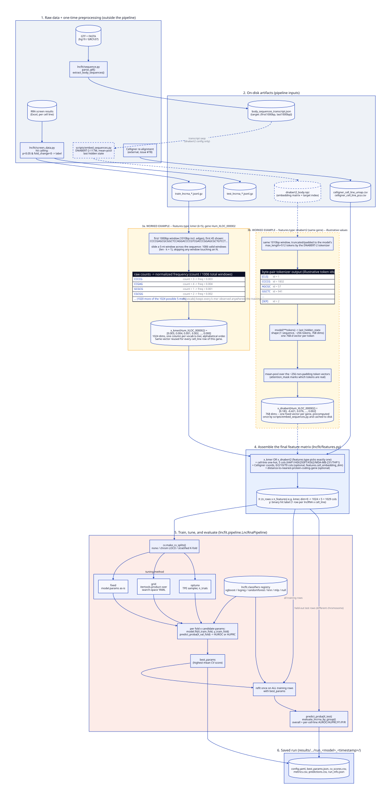

# lncFit

## Pipeline overview

The trainable classifier pipeline (`lncfit.pipeline.LncRnaPipeline`, driven by
`scripts/run_pipeline.py --config <file>.yaml`) turns raw screen data and
lncRNA sequences into a feature matrix, then trains/tunes/evaluates a model
against it. See [`configs/README.md`](configs/README.md) for the full config
schema and ready-to-run examples.

