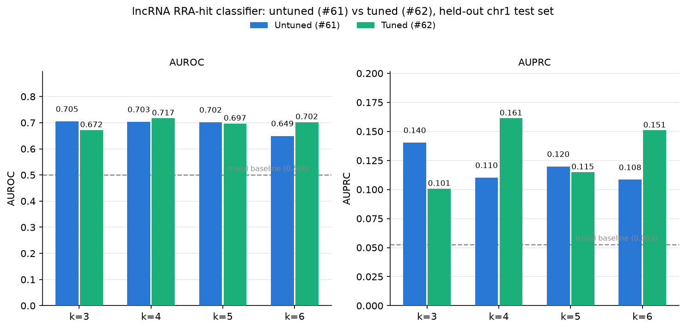

# lncRNA-level RRA hit classification (Day 14)

Issue #60: predict, per lncRNA x cell line, whether MAGeCK-RRA calls it a significant
depletion hit at Day 14 (RRA P value < 0.05 and log2 fold-change < 0), instead of
regressing per-guide log2 fold-change.

Dataset: `data/processed/lncrna_rra_day14.jsonl.gz`, built from the previously-unparsed
`S2F`-`S2J` RRA sheets of `mmc3.xlsx`, restricted to `Target group == "long non-coding RNA"`
rows (5,496 lncRNAs x 5 cell lines = 27,480 records; 1,249 hits, 4.5% positive rate).
Chromosome-1 hold-out split (`train_lncrna_day14_chrom1.jsonl.gz` / `test_lncrna_day14_chrom1.jsonl.gz`):
25,010 train / 2,470 test.

Features: pooled k-mer frequencies across all of a lncRNA's guide spacers (no single guide
sequence exists at this granularity) + cell-line one-hot. XGBoost classifier
(`binary:logistic`, `scale_pos_weight` set from the train split's class ratio) — same
hyperparameter defaults and `tree_method="hist"` as `scripts/train_xgboost.py`.

## k sweep, untuned (chr1 test split)

Initial pass (#61): fixed hyperparameters copied from the guide-level regression model's
defaults, `scale_pos_weight` computed once from the raw train-set class ratio (~21.35).

| k | features | AUROC | AUPRC |
|---|---|---|---|
| **3** | 69  | **0.7049** | **0.1403** |
| 4 | 260 | 0.7031 | 0.1102 |
| 5 | 1019 | 0.7018 | 0.1198 |
| 6 | 4040 | 0.6494 | 0.1084 |

At the time, k=3 looked like the winner on both AUROC and AUPRC. That conclusion did not
survive proper tuning (see below) — it was an artifact of comparing across k with the same
untuned, guide-level-borrowed hyperparameters at every k, not a real property of k=3.

## Hyperparameter tuning (issue #62)

`scripts/tune_lncrna_xgboost.py`: Optuna TPE (50 trials) + chromosome LOCO-CV (20 folds,
`build_lncrna_folds`), searching the same 7 hyperparameters as `scripts/tune_xgboost.py`
plus a `scale_pos_weight_mult` that scales each fold's natural neg/pos ratio — the
untuned pass fixed this at 1.0x; here it's tuned per trial. CV objective is mean AUPRC
across folds (more informative than AUROC/accuracy at a ~4.5% positive rate). Best trial's
config is retrained on all training data (early-stopped on chr22) and evaluated once on
the real chr1 held-out test set — the number that matters, not the CV score itself.

| k | CV mean AUPRC | held-out AUROC (tuned) | held-out AUPRC (tuned) | held-out AUPRC (untuned) | delta |
|---|---|---|---|---|---|
| 3 | 0.1668 ± 0.057 | 0.6719 | 0.1007 | 0.1403 | **-0.0396** |
| **4** | 0.1510 ± 0.055 | **0.7169** | **0.1613** | 0.1102 | **+0.0511** |
| 5 | 0.1273 ± 0.032 | 0.6968 | 0.1149 | 0.1198 | -0.0049 |
| 6 | 0.1133 ± 0.029 | 0.7023 | 0.1509 | 0.1084 | +0.0425 |

**k=4 (tuned) is the best configuration found overall** — AUROC 0.7169 / AUPRC 0.1613,
beating every untuned run including the original "winner" k=3. k=6 also improved
substantially once tuned (AUPRC 0.1084 → 0.1509), while k=3 got *worse* despite having
the best CV score of the four (0.1668, also the best CV score of any k).

**Why k=3 regressed despite the best CV score**: its selected trial converged to
`scale_pos_weight_mult=0.25` (under-weighting the positive class relative to the natural
ratio) and its final retrained model early-stopped at just **3 trees**
(`n_estimators_final_model` in `data/model/xgboost_lncrna_best_params_k3.json`) — the chr22
early-stopping validation slice has few positives (19) and a low-capacity k=3 feature space
apparently let the model "peak" almost immediately on that slice without transferring to
chr1. This is a real risk of CV-selected hyperparameters in this dataset: 20-25 CV folds of
a few dozen positives each is enough to rank configs directionally but not enough to fully
trust the single best trial without checking the held-out set, which is exactly what
happened here. Full per-trial CV scores are in `tune_k<K>/cv_scores.csv`.

`scripts/plot_lncrna_auc_sweep.py` regenerates this from the committed metrics CSVs
(`metrics_k<K>.csv` for untuned, `tune_k<K>/final_eval_*/metrics.csv` for tuned).

## Per-cell-line breakdown, k=4 tuned (best config)

| cell line | AUROC | AUPRC |
|---|---|---|
| Overall | 0.7169 | 0.1613 |
| HAP1 | 0.6435 | 0.0831 |
| HEK293FT | 0.6882 | 0.0851 |
| K562 | **0.8106** | **0.3378** |
| MDA-MB-231 | 0.7544 | 0.0835 |
| THP1 | 0.6244 | 0.0598 |

All AUROC > 0.5; K562 stands out with AUPRC 0.34 vs. its 7.9% base rate (~4.3x lift).
Precision/recall at the default 0.5 threshold are still ~0 for most configs in this
sweep (this is a ~5%-positive-rate problem — a lower decision threshold or
precision-at-k framing would be a better fit than F1@0.5 for a follow-up).

## Files

- `metrics_k3.csv`, `metrics_k4.csv`, `metrics_k5.csv`, `metrics_k6.csv` — untuned
  per-cell-line classification metrics for each k (#61).
- `tune_k<K>/cv_scores.csv` — per-trial, per-chromosome CV AUPRC for the Optuna search.
- `tune_k<K>/final_eval_<timestamp>/` — tuned final model's held-out test metrics and
  predictions for each k.
- `data/model/xgboost_lncrna_best_params_k<K>.json` — best hyperparameters + CV/held-out
  summary for each k.
