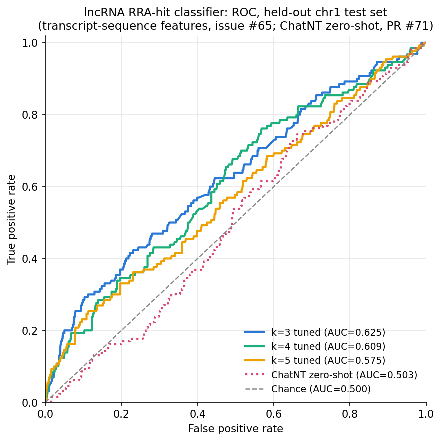
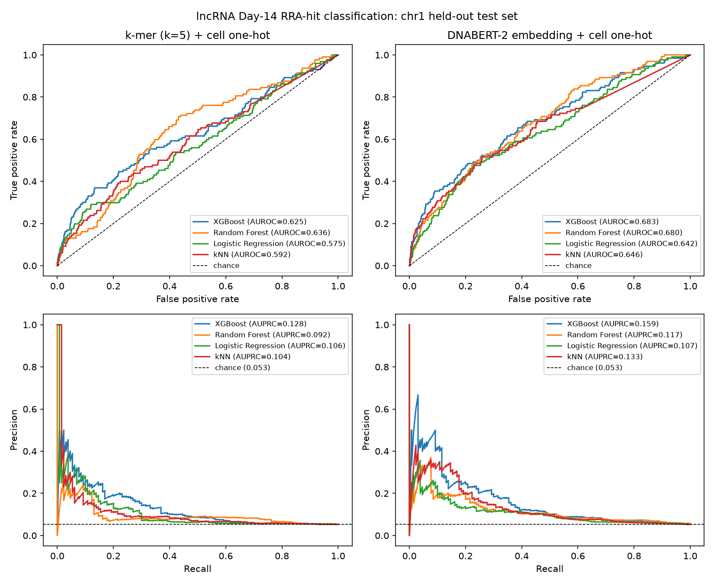

# lncRNA-level RRA hit classification (Day 14)

Issue #60: predict, per lncRNA x cell line, whether MAGeCK-RRA calls it a significant
depletion hit at Day 14 (RRA P value < 0.05 and log2 fold-change < 0), instead of
regressing per-guide log2 fold-change.

Dataset: `data/processed/lncrna_rra_day14.jsonl.gz`, built from the previously-unparsed
`S2F`-`S2J` RRA sheets of `mmc3.xlsx`, restricted to `Target group == "long non-coding RNA"`
rows (5,496 lncRNAs x 5 cell lines = 27,480 records; 1,249 hits, 4.5% positive rate).
Chromosome-1 hold-out split (`train_lncrna_day14_chrom1.jsonl.gz` / `test_lncrna_day14_chrom1.jsonl.gz`):
25,010 train / 2,470 test.

> **The numbers below are the corrected ones (issue #65).** The #61/#62 runs built
> features by pooling k-mer frequencies over each lncRNA's **guide spacer sequences**
> (the CRISPR-Cas13 guides designed *against* the lncRNA) — not the lncRNA's own
> sequence. That's a real confound, not a minor caveat: guide design is an engineered
> process, so any signal learned from it isn't necessarily lncRNA biology. See the
> "Superseded results" section at the bottom for the old numbers and why they don't
> hold up. Features now come from each lncRNA's own **spliced transcript sequence**
> (Sarropoulos et al. 2019, PMC6660317, hg19/GRCh37 — see issue #66 on why hg38 was
> dropped entirely rather than kept as an option).

Features: k-mer frequencies over the lncRNA's own spliced transcript sequence
(`lncfit.sequence.extract_spliced_sequences`, longest transcript per gene) + cell-line
one-hot. XGBoost classifier (`binary:logistic`), same `tree_method="hist"` as
`scripts/train_xgboost.py`. Reproduce end-to-end in
`notebooks/lncrna_rra_analysis.py` (`uv run marimo edit notebooks/lncrna_rra_analysis.py`).

## k sweep, untuned (chr1 test split)

Fixed hyperparameters copied from the guide-level regression model's defaults,
`scale_pos_weight` computed once from the raw train-set class ratio (~21.35).

| k | features | AUROC | AUPRC |
|---|---|---|---|
| 3 | 69   | 0.6051 | 0.0846 |
| **4** | 261  | **0.6352** | 0.1050 |
| 5 | 1029 | 0.5980 | 0.1015 |
| 6 | 4101 | 0.5872 | **0.1079** |

Trivial baseline on this test set: AUROC 0.500, AUPRC 0.053 (5.3% positive rate). Every
k beats it, but only modestly (max AUROC 0.635, a ~1.3x lift on AUPRC at best) — nowhere
near the 0.70+ AUROC the guide-sequence-based numbers showed. That gap is the size of
the guide-design confound: a real chunk of the previously reported "signal" was not
lncRNA biology.

## Hyperparameter tuning (issue #62, re-run for #65)

`scripts/tune_lncrna_xgboost.py`: Optuna TPE (50 trials) + chromosome LOCO-CV (20 folds,
`build_lncrna_folds`), searching 7 hyperparameters plus a `scale_pos_weight_mult` that
scales each fold's natural neg/pos ratio. CV objective is mean AUPRC across folds. Best
trial's config is retrained on all training data (early-stopped on chr22) and evaluated
once on the real chr1 held-out test set.

| k | CV mean AUPRC | held-out AUROC (tuned) | held-out AUPRC (tuned) | held-out AUPRC (untuned) |
|---|---|---|---|---|
| **3** | 0.1307 ± 0.052 | 0.6248 | **0.1190** | 0.0846 |
| 4 | (killed before completion; see below) | 0.6087 | 0.0932 | 0.1050 |
| 5 | (killed before completion; see below) | 0.5748 | 0.0981 | 0.1015 |
| 6 | *not completed* | *not completed* | *not completed* | 0.1079 |

k=3 tuned is the best AUPRC found (0.119, ~2.3x the 0.053 baseline), improving on its own
untuned run (0.085) — unlike the #62 guide-sequence result, where tuning *hurt* k=3.
k=4 and k=5 tuning slightly underperformed their untuned baselines this time. **k=6's
tuning sweep was stopped by request after trial 8/50** (large feature space made it far
slower than k=3-5; partial per-trial CV scores are in `tune_k6/cv_scores.csv`, but there
is no completed held-out evaluation for it — it is not included as a "tuned" result).

**Caveat on k=3 tuned**: its retrained final model has only **4 trees**
(`n_estimators_final_model` in `data/model/xgboost_lncrna_best_params_k3.json`) — the
same early-stopping-on-a-tiny-slice pattern seen in the original #62 tuning (chr22's
early-stop slice has only 19 positives). A 4-tree model landing on the best AUPRC of the
sweep is plausible but not something to over-trust; a follow-up should revisit the
early-stopping chromosome choice or patience for low-capacity k values.



`scripts/plot_lncrna_roc.py` regenerates this from each completed tuning run's
`tune_k<K>/final_eval_*/predictions.csv`. k=6 has no curve — its tuning sweep was
stopped early (see above) and has no held-out predictions to plot.

## Per-cell-line breakdown, k=3 tuned (best AUPRC)

| cell line | AUROC | AUPRC |
|---|---|---|
| Overall | 0.6248 | 0.1190 |
| HAP1 | 0.5203 | 0.0570 |
| HEK293FT | 0.6109 | 0.1047 |
| K562 | **0.6956** | **0.2273** |
| MDA-MB-231 | 0.5805 | 0.0576 |
| THP1 | 0.6006 | 0.0723 |

K562 is consistently the strongest cell line across both the untuned and tuned sweeps
(also true in the old, invalidated guide-sequence numbers) — worth a closer look in a
follow-up on whether that's a real biological signal specific to K562 or a dataset
artifact. Precision/recall at the default 0.5 threshold are ~0 across the board (still
a ~5%-positive-rate problem; precision-at-k would be a better fit than F1@0.5).

## Row-level stratified CV comparison (chromosome-agnostic; xgboost + logreg; k=3-6)

A second tuning pass, `scripts/tune_lncrna_stratified.py`, answers a different
question from the LOCO-CV sweep above: what if hyperparameter search uses a plain
`StratifiedKFold(n_splits=5)` over the binary label instead of chromosome-grouped
folds? **This is deliberately not leak-free**: every cell-line row for a given
lncRNA shares one k-mer vector (only the cell-line one-hot differs), so the same
lncRNA's sequence can appear in both a fold's train and validation split via its
other cell-line rows. Kept this way on request, for direct comparison against the
chromosome-grouped numbers above — not because it's a sound generalization
estimate. The tell: CV mean AUPRC runs ~0.17 for xgboost vs. the true chr1
held-out AUPRC of ~0.12-0.15. Trust the held-out column, not the CV column.

Also swept a class-weight on/off toggle (xgboost: tuned `scale_pos_weight_mult` vs.
fixed at 1; logreg: `class_weight="balanced"` vs. `None`) and, for xgboost, a
`VarianceThreshold` filter on k-mer columns (fit per fold / per final-train split,
never on val/test) to make k=6's 4,096-column space more tractable.

**chr1 held-out test results** (best class-weight variant per k, by AUPRC):

| k | model | class weight | n features | AUROC | AUPRC |
|---|---|---|---|---|---|
| 3 | xgboost | off | 69 | 0.6623 | 0.1293 |
| 4 | xgboost | off | 261 | 0.6631 | 0.1227 |
| **5** | **xgboost** | **off** | 1,029 | 0.6628 | **0.1446** |
| 6 | xgboost | off (variance filter, threshold=2e-7) | 2,468 / 4,101 | 0.5987 | 0.1209 |
| 3-6 | logreg | on/off (barely differs) | 69-2,468 | ~0.578 | ~0.109-0.110 |

k=5 (off) is the best AUPRC found anywhere in this project's history on the real
chr1 test set among the Optuna-tuned configs above -- but see the `max_depth`
follow-up below, which pushes both records (AUROC and AUPRC) further still.
k=6 underperforms k=3-5 on 4 of 5 cell lines (HAP1, HEK293FT,
MDA-MB-231, THP1) despite the variance filter, while being the *best* single
cell-line result anywhere (K562, AUPRC 0.315 with class-weight on) — consistent
with a dimensionality problem, not a k=6-is-just-worse conclusion. The final
90/10-split XGBoost training set has only ~1,007 positives; k=6's 2,468 post-filter
features means ~2.5 features per positive example (k=5 sits right at ~1:1, k=3 is
~0.07:1) — past the point where a model can reliably distinguish real signal from
per-fold noise, especially under CV that's already leaking lncRNA identity across
folds. The variance filter itself (fit on train-fold frequency variance) only cut
xgboost's k=6 per-trial wall-clock by ~14% (4:38 -> 4:00) since `tree_method="hist"`
with `colsample_bytree≈0.8` is bottlenecked by tree depth and row count, not raw
column count — it's a legitimate noise-reduction step, not a speed fix.

Class-weight reweighting doesn't clearly help xgboost (off wins on AUPRC at k=3,
4, and 5) and is a rounding error for logreg. logreg stays flat at ~0.578 AUROC
across every k and class-weight setting -- k-mer counts alone don't give it more
to work with as k grows.

### max_depth follow-up: forcing depth=9 onto tuned configs

Two one-off probes (`tune_stratified/k4_depth9_comparison.json`,
`tune_stratified/k5_depth9_comparison.json`) tested forcing `max_depth=9`
(matching k=3's tuned depth) onto k=4's and k=5's Optuna-tuned configs, keeping
every other hyperparameter unchanged:

| k | class weight | original depth | AUROC (orig -> depth=9) | AUPRC (orig -> depth=9) | n_estimators (orig -> depth=9) |
|---|---|---|---|---|---|
| 4 | on | 6 | 0.6577 -> 0.6365 (worse) | 0.1120 -> 0.1155 | 58 -> 37 |
| 5 | on | 5 | 0.6482 -> 0.6190 (worse) | 0.1268 -> 0.1104 (worse) | 72 -> 33 |
| 5 | off | 4 | 0.6628 -> **0.6801 (new best AUROC)** | 0.1446 -> **0.1460 (new best AUPRC)** | 495 -> 106 |

A clear, replicated pattern: **forcing depth=9 helps the class-weight=off
configs but hurts class-weight=on ones.** Both reweighted (`on`) configs
collapse to very few trees once forced deeper (58->37, 72->33) --
`scale_pos_weight` pushes predictions toward positives faster, so early
stopping triggers sooner once trees can also go deeper, cutting the ensemble
down before it benefits from the extra depth. The non-reweighted (`off`)
configs don't have that interaction; k=5/off/depth=9 gets a straightforward
capacity boost and is now **the best AUROC and AUPRC found anywhere in this
project's history** (previous records: AUROC 0.6757 at k=3/on, AUPRC 0.1446 at
k=5/off/depth=4). Per-cell-line, k=5/off/depth=9 improves HAP1 and THP1
substantially (AUPRC 0.127->0.184, 0.160->0.261) while K562 stays strong
(AUROC 0.757) and MDA-MB-231 dips slightly (0.268->0.215).

A separate probe on the plain **untuned** k=4 defaults
(`scripts/run_lncrna_classifier.py`, no Optuna involved, no class-weight
reweighting) told a version of the same story: AUROC improved 0.6352 -> 0.6578,
AUPRC 0.1050 -> 0.1228 when forced to depth=9, consistent with "no reweighting
+ more depth" being the combination that benefits.

Net: `max_depth` isn't a free knob to crank in isolation -- it interacts with
`scale_pos_weight`/early stopping, not just with the other tree-shape
hyperparameters. The one-off comparison JSONs only test the two hyperparameter
combinations described above; they are not a re-run of the full Optuna search
at depth=9, so there may be an even better config than k=5/off/depth=9 that
a proper search around fixed depth=9 would find.

Files: `tune_stratified/<model>_k<K>_cw<on|off>/` (`cv_scores.csv`,
`final_eval_<timestamp>/{metrics,predictions,run_info}`), `tune_stratified/summary.csv`
(aggregated via `scripts/summarize_stratified_tuning.py`), the `k4_depth9_comparison.json`
/ `k5_depth9_comparison.json` one-off probes above, and
`data/model/<model>_lncrna_stratified_k<K>_cw<on|off>_{best_params,vocab}.json`
(+ `_variance_mask.json` for k=6). `logreg_k6_cwoff` was stopped mid-run by
request and is not included (no completed held-out evaluation).

## Feature engineering x model comparison (k-mer vs DNABERT-2, 4 classifiers)

`scripts/run_lncrna_feature_model_comparison.py`: same stratified 90/10 train/early-stop
carve-out (seed=42) and chr1 held-out test evaluation as the max_depth follow-up above,
run across two feature sets and four models:

- **k-mer**: transcript k-mer frequencies (k=5, the established best k) + cell-line
  one-hot (`build_lncrna_features`), 1029 columns.
- **dnabert2**: precomputed DNABERT-2 transcript embeddings + cell-line one-hot
  (`build_lncrna_embedding_features`), 773 columns (768 dims + 5 cell one-hot).
- **xgboost**: grid search over `learning_rate` x `subsample` x `colsample_bytree` (36
  combos), `max_depth` fixed at 9 and every other hyperparameter anchored at the
  k=5/class-weight-off tuned config above (`min_child_weight=3`, `reg_alpha=3.19`,
  `reg_lambda=3.08e-6`) — the *same* anchors and grid applied to both feature sets, no
  Optuna.
- **randomforest, logreg, knn**: single fixed-hyperparameter fit each (registered
  wrappers in `lncfit/classifiers/`), no grid search: random forest (500 trees,
  `class_weight="balanced_subsample"`), logistic regression (`C=1.0`,
  `class_weight="balanced"`), kNN (`n_neighbors=25`, distance-weighted).

| features | model | AUROC | AUPRC |
|---|---|---|---|
| k-mer | logreg | 0.5753 | 0.1090 |
| k-mer | knn | 0.5918 | 0.1055 |
| k-mer | xgboost | 0.6251 | 0.1329 |
| k-mer | randomforest | 0.6356 | 0.0944 |
| dnabert2 | logreg | 0.6416 | 0.1106 |
| dnabert2 | randomforest | 0.6796 | 0.1207 |
| dnabert2 | knn | 0.6456 | 0.1357 |
| **dnabert2** | **xgboost** | **0.6829** | **0.1648** |

Best xgboost combo, k-mer: `learning_rate=0.02, subsample=0.5, colsample_bytree=0.9`.
Best xgboost combo, dnabert2: `learning_rate=0.01, subsample=0.5, colsample_bytree=0.5`.



**DNABERT-2 embeddings beat k-mer frequencies for every one of the 4 models**, on both
AUROC and AUPRC — the richer sequence representation carries real signal that raw k-mer
counts don't capture, and xgboost is the best model on either feature set. The
dnabert2/xgboost AUROC (0.6829) is essentially tied with this project's previous overall
best (0.6801, the k=5/off/depth=9 one-off probe above) despite using a totally different
feature representation, and its AUPRC (0.1648) is below that probe's follow-up grid best
(0.1776) but ahead of the probe itself (0.1460).

> **Note on comparing against `grid_search_k5_depth9/`:** that earlier grid used *sparse*
> k-mer features, while this comparison rebuilds k-mer features *dense* (matching
> `scripts/run_lncrna_classifier.py`'s established convention). XGBoost treats a sparse
> matrix's implicit zeros as *missing* but a dense matrix's zeros as *present* — for
> k-mer frequencies a zero is a real, informative value ("this k-mer does not occur"),
> so dense is the correct choice, but it means the two grids' numbers for the same
> hyperparameter combo are not identical (e.g. best k-mer AUPRC here is 0.1329 vs 0.1776
> there). Treat the dense numbers in this section as the more correct ones going forward.

Files: `feature_model_comparison/summary.csv` (this table), `predictions_<features>_<model>.csv`,
`xgboost_grid_<features>.csv` (full 36-row grids), `roc_pr_curves.png`, `run_info.json`.

### MLP classification head on DNABERT-2 embeddings (no separate ML model)

`scripts/run_dnabert2_mlp_classifier.py`: instead of routing the DNABERT-2 embedding
through a separate xgboost/randomforest/logreg/knn model, `lncfit/classifiers/mlp.py`
(registered as `"mlp"`) attaches a genuine trainable classification layer directly on
top of it -- one hidden layer (`Linear -> ReLU -> Dropout -> Linear`), trained
end-to-end by gradient descent (`BCEWithLogitsLoss(pos_weight=...)` for the ~5%
positive rate + Adam), with a 10% stratified slice of the training data held out inside
`fit()` purely for early stopping. Same input as the dnabert2 column above
(`build_lncrna_embedding_features`: embedding + cell-line one-hot "layer"), same chr1
held-out test.

The first pass used fixed defaults (`hidden=128, lr=1e-3, batch_size=256`, no tuning at
all): AUROC 0.6729, AUPRC 0.1533. `scripts/grid_search_dnabert2_mlp.py` then grid-searched
the 3 hyperparameters most likely to matter -- `batch_size` x `learning_rate` x `hidden`
(27 combos, `dropout=0.2`/`max_epochs=200`/`patience=10` held fixed, no Optuna):

| features | model | AUROC | AUPRC |
|---|---|---|---|
| dnabert2 | logreg | 0.6416 | 0.1106 |
| dnabert2 | knn | 0.6456 | 0.1357 |
| dnabert2 | randomforest | 0.6796 | 0.1207 |
| dnabert2 | xgboost | 0.6829 | 0.1648 |
| dnabert2 | mlp, untuned defaults | 0.6729 | 0.1533 |
| **dnabert2** | **mlp, tuned (`batch_size=16, lr=0.002, hidden=64`)** | 0.6822 | **0.1986** |
| dnabert2 | mlp, best AUROC (`batch_size=16, lr=0.0005, hidden=256`) | **0.6901** | 0.1649 |

Both tuned MLP configs beat every other model on both metrics — **AUPRC 0.1986 and
AUROC 0.6901 are new bests anywhere in this project's history** (previous bests: AUROC
0.6829 dnabert2/xgboost, AUPRC 0.1776 from the sparse-feature `grid_search_k5_depth9/`
run, see the note below on why that comparison isn't quite apples-to-apples). The
`batch_size=16, lr=0.002, hidden=64` config is the one saved to
`predictions_dnabert2_mlp.csv`/`roc_pr_curves.png` above (picked by AUPRC, same
convention as the xgboost grid); the higher-AUROC config trades away some AUPRC and is
reported here for completeness rather than re-saved.

The best single combo uses `batch_size=16`, but batch size alone isn't a clean,
systematic effect: mean AUPRC across the grid is nearly identical for `batch_size`
16/32/64 (0.157/0.163/0.159), and `batch_size=16` also produced the single *worst*
combo in the whole grid (`lr=0.002, hidden=256` -> AUPRC 0.0828). The tuned result looks
more like a specific `(batch_size, lr, hidden)` interaction landing in a good spot than
"smaller batches are just better" — 3 of the top 8 combos by AUPRC use `batch_size=16`,
but so does the worst one. `roc_pr_curves.png` above shows the tuned (saved) curve only,
not the untuned default for comparison — see `mlp_grid_dnabert2.csv` for the full 27-row
spread if reproducing this.

> **Implementation note:** training an xgboost/randomforest model (both spin up their
> own OpenMP thread pools) earlier in the same process as PyTorch can silently deadlock
> on macOS -- `MLPClassifier.fit()` pins torch to a single thread
> (`torch.set_num_threads(1)`) to avoid this; the model is small enough that this costs
> no meaningful speed. Even the smallest grid combo (`batch_size=16`, 1,407 batches/epoch)
> trains a full run (up to 200 epochs, early-stopped in practice) in well under a minute
> on CPU alone — the model is ~99k-590k parameters depending on `hidden`, tiny compared to
> DNABERT-2 itself (~100M+ parameters, frozen, not being trained here at all).

Files: `feature_model_comparison/predictions_dnabert2_mlp.csv`, `metrics_dnabert2_mlp.csv`,
`run_info_mlp.json`, `mlp_grid_dnabert2.csv` (full 27-row grid), `mlp_grid_dnabert2_best.json`.

#### Follow-up: even smaller batch, even lower learning rate

`scripts/grid_search_dnabert2_mlp_smaller_batch.py`: pushed both knobs further down --
`batch_size` in `{4, 8}` (below the first grid's smallest, 16) and `learning_rate` in
`{0.0001, 0.0002, 0.0005}` (below its smallest, 0.0005) -- holding `hidden=64` fixed at
the AUPRC-best value above.

| batch_size | learning_rate | AUROC | AUPRC |
|---|---|---|---|
| 8 | 0.0001 | 0.6655 | 0.1486 |
| 4 | 0.0001 | 0.6711 | 0.1499 |
| 4 | 0.0002 | 0.6714 | 0.1535 |
| 8 | 0.0002 | 0.6763 | 0.1623 |
| 8 | 0.0005 | 0.6779 | 0.1711 |
| **4** | **0.0005** | **0.6920** | 0.1752 |

Two clear, honest findings, not the ones a "smaller is better" story would predict:

- **Lower learning rate did not help.** Within both batch groups, AUROC and AUPRC
  increase monotonically as `lr` goes from 0.0001 up to 0.0005 (the *highest* of the
  three values tried here, itself still lower than the first grid's overall-best
  `lr=0.002`). Going lower than 0.0005 made things worse every time.
- **`batch_size=4, lr=0.0005` sets a new best AUROC (0.6920)**, edging past the first
  grid's 0.6901 -- but its AUPRC (0.1752) does not beat the first grid's best AUPRC
  (0.1986, `batch_size=16, lr=0.002, hidden=64`). That config remains the one saved to
  `predictions_dnabert2_mlp.csv` (picked by AUPRC, the established convention here);
  this follow-up isn't re-saved since it doesn't improve on it by that metric.

Files: `feature_model_comparison/mlp_grid_dnabert2_smaller_batch.csv`,
`mlp_grid_dnabert2_smaller_batch_best.json`.

## Celligner cell-line embedding (issue #78)

Every model above represents the cell line as a 5-column one-hot
(`cell_HAP1`, `cell_HEK293FT`, `cell_K562`, `cell_MDA-MB-231`, `cell_THP1`) --
telling the model *which* cell line a row is, but nothing about how the cell
lines relate to each other biologically. Issue #78 proposed replacing/augmenting
this with a real transcriptomic-similarity embedding from
[Celligner](https://github.com/broadinstitute/celligner) (Warren et al., *Nat
Commun* 2021), which aligns CCLE cell line and TCGA tumor RNA-seq onto a shared
2-D UMAP space.

The published Celligner data (all 5 Figshare versions checked) is frozen at
DepMap 19Q4 and doesn't include HAP1 at all -- so rather than use the stale
published coordinates, **the full Celligner alignment method was re-run from
scratch** against current DepMap data (24Q4), faithfully reimplementing the
original R pipeline (contrastive PCA, mutual-nearest-neighbor batch correction,
70-D PCA, UMAP) with `irlba`/`uwot`/`igraph`/`FNN`/`limma` instead of
Seurat/batchelor. See `data/external/README.md` for full methodology, provenance,
and caveats. Result: HAP1, K562, MDA-MB-231, THP1 now have real 2-D coordinates
(`data/external/celligner_cell_line_umap.csv`); **HEK293FT still has none** (not
a cancer cell line, never in CCLE/DepMap under any release) and is zero-filled
wherever this embedding is used.

**Validation (not just eyeballing distances among the 4 targets):** computed
each target's k=15 nearest CCLE neighbors in the aligned space and checked what
fraction share its true Oncotree lineage, against a baseline computed the same
way for all 1,668 lineage-annotated CCLE lines (mean purity ~53-54%, well above
chance; Myeloid and Lymphoid lines cluster especially cleanly at ~89%/~97%).
Result: **K562 and THP1 validate cleanly** (15/15 same-lineage neighbors, in
line with Myeloid's already-high ~89% average). **MDA-MB-231** scores 0/15 (both reruns this was checked),
but Breast lines only average ~55% purity to begin with and MDA-MB-231 is a
documented mesenchymal-like outlier among breast cell lines -- a plausible,
not confirmed, explanation. **HAP1 scores 0/15 then 1/15 (the 2 reruns this was checked) despite sitting in a lineage
(Myeloid) that otherwise clusters at ~89%** -- a genuine outlier with no
raw-expression QC explanation found, and the least stable of the 4 across
independent reruns (7.04 UMAP-unit shift vs. 1.25-3.10 for the others).
**HAP1's specific coordinates should be treated with real skepticism** (flagged
`"UNRELIABLE"` in the data file) -- kept per explicit request, not because
they've been shown trustworthy. Full analysis and the validation figure (all
1,673 CCLE lines colored by lineage, targets circled) are in
`data/external/README.md` and
`celligner_embedding_comparison/alignment_validation.png`.

`build_lncrna_features(..., celligner_embedding_dim=N)` appends N columns
alongside (not replacing) the existing cell one-hot: N=2 is the 2-D UMAP
Celligner normally publishes; N=10/70 uses that many columns of the richer
pre-UMAP PCA space this reimplementation also exports (`celligner_cell_line_pca.csv`
-- see `data/external/README.md`). Dimensionality is itself a hyperparameter here.
`scripts/run_celligner_embedding_comparison.py`: k=5 kmer features, the same
best-known xgboost hyperparameters from the feature x model comparison above,
dim in `{0, 2, 10, 70}`, same chr1 held-out test:

| dim | n_features | AUROC | AUPRC |
|---|---|---|---|
| 0 (off) | 1029 | 0.6251 | 0.1329 |
| **2 (UMAP)** | 1031 | 0.6395 | **0.1353** |
| 10 (PCA) | 1039 | 0.6529 | 0.1203 |
| **70 (PCA)** | 1099 | **0.6537** | 0.1194 |

Not "bigger is better": AUROC climbs steadily with more dimensions, but AUPRC
(the more informative metric at ~5% positive rate) peaks at dim=2 and gets
*worse* at 10/70 -- more embedding columns add noise/overfit risk for a model
that only needs to distinguish 5 categories. At dim=2, per-cell-line it's mixed,
not a uniform win: MDA-MB-231's AUROC jumps (0.681 -> 0.721) while its AUPRC drops
considerably (0.284 -> 0.159); HAP1 and THP1 both improve on AUROC; HEK293FT is
roughly flat as expected (it gets no real embedding signal, only zeros). This is
a single seed=42 run, not averaged over multiple seeds/folds. **HAP1's
contribution to any of these results should be read with the same caution as its
coordinates** (see Validation above) -- improvement here isn't independent
evidence the coordinates are correct, since a model can pick up *some* signal
from an unreliable embedding without that meaning the embedding reflects real
biology. Explore this interactively in
`notebooks/celligner_embedding_dimensionality.py`.

Files: `data/external/celligner_cell_line_umap.csv`, `data/external/celligner_cell_line_pca.csv`,
`data/external/README.md`, `celligner_embedding_comparison/summary.csv`,
`celligner_embedding_comparison/run_info.json`, `celligner_embedding_comparison/alignment_validation.png`.

## Pluggable pipeline (config-driven runner)

Every comparison above used a separate script per axis (a script per model, a
separate DNABERT-2 runner, XGBoost-only Optuna tuning, ad hoc grid searches).
`scripts/run_pipeline.py` + `lncfit.pipeline.LncRnaPipeline` collapses all of that
into one YAML-configured entry point: pick the model (any
`lncfit.classifiers` registry name), the feature type (k-mer or DNABERT-2), the
cell-line embedding (one-hot, Celligner UMAP, or PCA at any dimension), the
tuning method (fixed / grid / Optuna), and the CV strategy (none / chromosome /
stratified) all in one config file, then:

```bash
uv run python scripts/run_pipeline.py --config configs/pipeline/xgboost_kmer_optuna.yaml
```

See `configs/README.md` for the full schema, `configs/pipeline/*.yaml` for
ready-to-run examples, and `configs/search_spaces/*.yaml` for the grid/Optuna
hyperparameter ranges per model. This runner is additive -- the model-specific
tuning scripts referenced elsewhere in this file (`tune_lncrna_xgboost.py`,
`tune_lncrna_stratified.py`, the one-off `grid_search_*.py` probes) still exist
and still produce the exact numbers already reported above; this is the place to
run a *new* combination without writing a new script.

## Files

- `metrics_k3.csv`, `metrics_k4.csv`, `metrics_k5.csv`, `metrics_k6.csv` — untuned
  per-cell-line classification metrics for each k (corrected transcript-sequence features).
- `tune_k<K>/cv_scores.csv` — per-trial, per-chromosome CV AUPRC for the Optuna search
  (k=6 is partial — only 8/50 trials, stopped by request).
- `tune_k<K>/final_eval_<timestamp>/` — tuned final model's held-out test metrics and
  predictions for each completed k (3, 4, 5).
- `data/model/xgboost_lncrna_best_params_k<K>.json` — best hyperparameters + CV/held-out
  summary for each k.
- `../../notebooks/lncrna_rra_analysis.py` — marimo notebook reproducing the data
  loading, feature building, and a quick interactive fit.

## Superseded results (guide-sequence features — do not use)

The original #61/#62 passes built features from each lncRNA's **guide spacer
sequences** instead of its own sequence (issue #65). Kept here only for the historical
record of what changed and by how much:

| k | untuned AUROC / AUPRC (guide-seq) | tuned AUROC / AUPRC (guide-seq) |
|---|---|---|
| 3 | 0.7049 / 0.1403 | 0.6719 / 0.1007 |
| 4 | 0.7031 / 0.1102 | 0.7169 / 0.1613 |
| 5 | 0.7018 / 0.1198 | 0.6968 / 0.1149 |
| 6 | 0.6494 / 0.1084 | 0.7023 / 0.1509 |

Every one of these is higher than its corrected counterpart above. The delta is the
guide-design confound, not a regression in the model.
